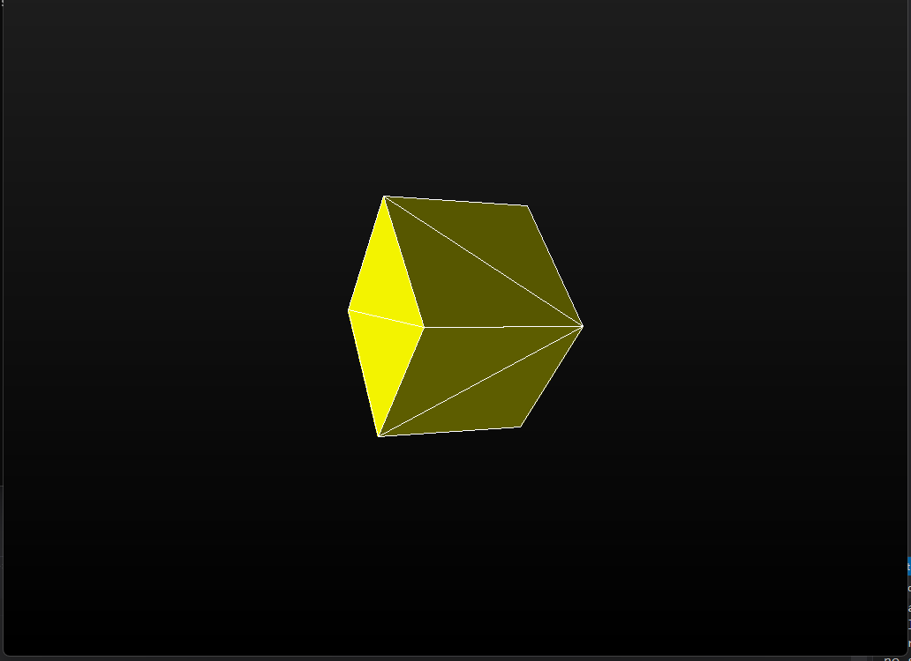
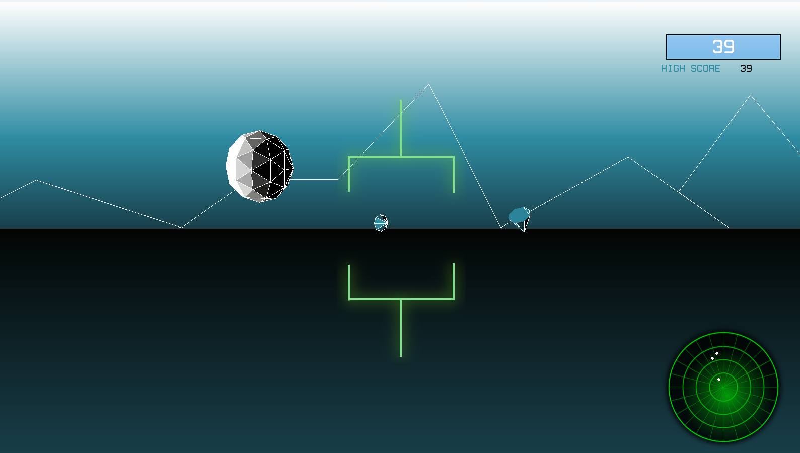
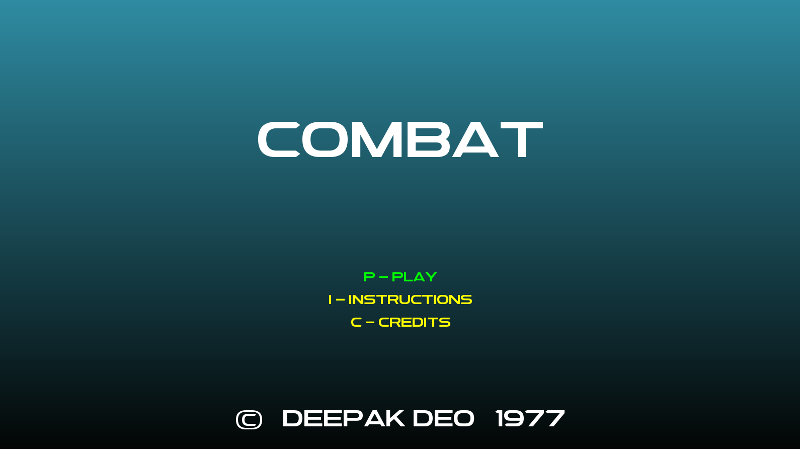
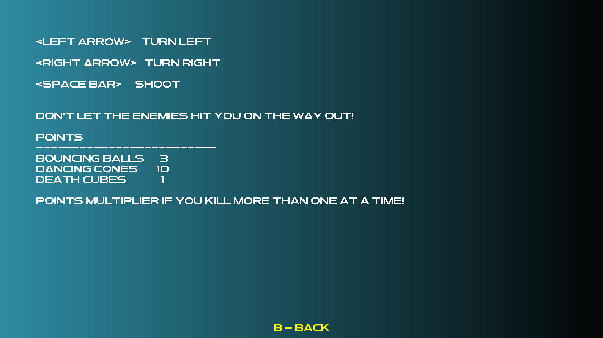
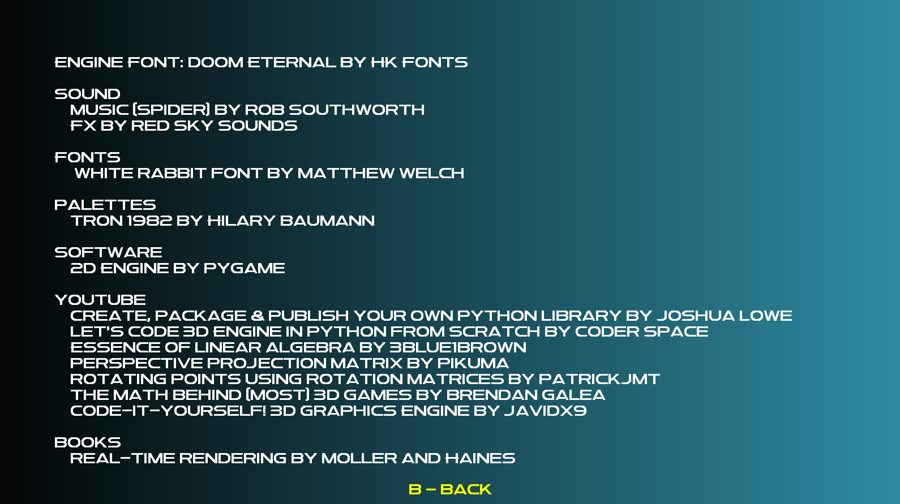

# Welcome to Retro3D!


Retro3D is a 3D game engine written in Python.

All of the rendering is done in code  
(as opposed to using your 3d video card).
<BR><BR><BR><BR>


### Two ways to use Retro3d

1) install the library using 'pip install Retro3d'

2) download the project from https://github.com/deepakbr14
   and add it to your project/solution.
<BR><BR><BR><BR>


### Sample Project : HelloWorld <link>
This is the simplest form of a project using Retro3d.  
It just shows a rotating cube. 


<BR><BR><BR><BR>

### Sample Project : Combat <link>
This is basic clone of the arcade game BattleZone. This game will  
show you how to handle camera movement, model loading, sound,   
music, player input, and showing 2d HUD graphics.  Retro3D  
uses pygame for a lot of functionality like drawing, sound, etc.




<BR><BR><BR><BR>

### How to step through Retro3D Engine Code
I've built Retro3D using Microsoft Visual Studio Community 2019.  
My Visual Studio Solution looked like this:

- Solution  
    - Combat
    - Retro3d

I added the Retro3d.pyproj (python project) as a reference.


<BR><BR><BR><BR>

### Easy Game Development

The 'game engine' part of Retro3D is there so you can get your  
game up and running quickly.

The game title, instructions, and credits are all auto-generated  
based on the contents of your ConfigGame object.

For example, when you do this in your main.py

```
config = ConfigGame()

config.screen_resolution = pg.math.Vector2(1024, 768)
config.title = "Combat";
config.author = "Deepak Deo"
config.year = "1977"
```

the game engine will automatically create a window (1024x768)  
and show the title and author on the cover screen.



You can also easily add instructions...


and game credits.



<BR><BR><BR><BR>

### Future Changes
<BR>

##### 3D Engine

* engine optimizations

* better inline documentation of 3d engine math 

* autoreflections - just the geometry upside down

* some form of very cheap shadows

* Have not yet passed the teapot test..

* Display lists should hold tris, not objs
  for better optimization + variety of rendering types within
  a single object (i.e. solid + transparent, etc)

* Need proper clipping. should be adding vertices to show part of the poly.
  use z buffer to hide 'behind' polys
  engine still needs to handle object draw ordering

* Use .mtl file along with .obj so that the obj files can have color per face info
  also, need to use 'materials' so that we can color objs on top of what the .obj file specifies.
  right now it's just one color per object

* Support multiple lights, multiple light types (i.e. point), and light color

* Optimize by use njit properly
  https://numba.readthedocs.io/en/stable/user/performance-tips.html

* Optimize draw_normals method

* Optimize Matrix class: should have pre-multipled matrix methods: ie zxyt

* The core pipeline is shit:
  not using python for single line list processing as i should
  copying and recopying vert_lists/matrices when dealing with vertex transformation
  normals transformation is even worse!
  math could use some streamlining
               
* Draw vertices with flag (like normals)
  self.draw_vertices = False
  if obj.draw_vertices:
      for vertex in list_vertex:
          pg.draw.circle(self.screen, pg.Color('white'), vertex, 6)    

* Shaded outline shouldn't show the diagonal line of the tri
  maybe precalc which line is the longest and flag it

<BR>

##### Game Engine


* Upgrade rez system. Maybe break out sound into a proper
  sound engine. 

* Create a high score system that auto stores on line.
  Develoepr should just have to say type of score.

* support for full screen mode. see  
  https://www.delftstack.com/howto/python-pygame/set-window-to-fullscreen-in-pygame/

* need safety code for model loading. assuming just tris right now.

* formal font system. just drop in a folder and use. 
  art and sound should be just as easy.

* Fomral input system.
  Support mouse input for Game

* Use texture sheets

<BR>

##### Common

* Make code more 'pythonic'

* Need simpler/cleaner way of doing imports 

* Abstract out pygame stuff or use directly?
  i.e. font system, image loading with error checking
  same for python standard lib and si code.

* 'dsd's in code

<BR>

##### Community

* Instructions on how others can contribute to the project.

* how do others tell me/us what they want?

* Formal page on retro3D.org or something like that.  
  Have documentation of Engine functions and tutorials.
  And some youTube vids! And some place to converse about
  using this thing. Don't forget to udpate url in setup.py  
  and links in this readme file.

* Make some more sample games:
  - Fighter Jet
  - Racing
  - Space Battle
  - Tron
  - Fractal Terrain Flyer

<BR>

##### Cosmetic Changes

* Want a cheesy 80s/90s style 3d game engine intro.  
  see https://youtu.be/DIMlll1gOWQ?t=31

* Make the Cover/Instructions/Credits look less-shitty :/

 
<BR><BR><BR><BR>
